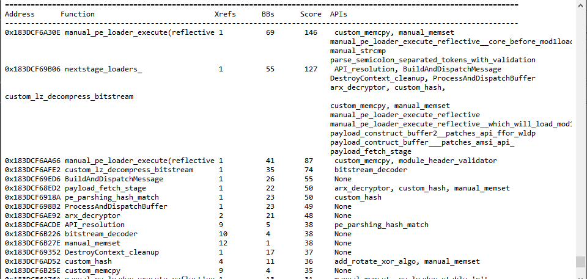
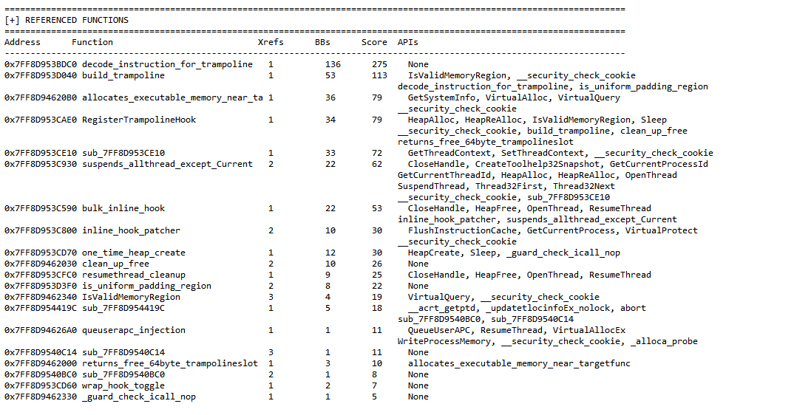

# FuncTriage

> Lightweight function triage and prioritization framework for IDA Pro.

FuncTriage is an IDA Pro script designed to triage and prioritize functions during binary analysis using structural heuristics, cross-reference analysis, and behavioral indicators.

It helps reverse engineers quickly identify **high-value** or **suspicious** routines such as:

- Unpacking / decoding logic
- Hooking and trampoline routines
- Memory injection behavior
- Thread manipulation and execution control
- Core orchestration logic in unknown binaries

---

# 🔍 Overview

FuncTriage scans every function in a binary and assigns a **heuristic score** based on:

- Control-flow complexity (basic block count)
- Cross-reference frequency
- API usage patterns
- Zero-xref heuristics (potential hidden or indirectly invoked logic)

The script categorizes functions into two major groups:

## ✔ Referenced Functions

Functions actively referenced or called throughout the binary.

## ⚠ Zero-Xref Functions (Heuristic)

Functions with no detected incoming references but strong structural or behavioral indicators suggesting hidden, indirect, or dynamically invoked execution paths.

---

# ⚙️ Features

- Heuristic-based function scoring
- CFG complexity analysis
- Cross-reference frequency analysis
- API extraction from direct and indirect calls
- Zero-xref function detection
- Structured and readable console output
- Lightweight and fast execution
- Useful for malware triage and unknown binary analysis

---

# 📊 Output

FuncTriage ranks functions using multiple structural and behavioral signals.

Each entry contains:

| Field | Description |
|-------|-------------|
| Address | Function entry address |
| Function | Function name |
| Xrefs | Number of incoming references |
| BBs | Basic block count (CFG complexity) |
| Score | Final heuristic importance score |
| APIs | Detected API calls |

---

# 🚀 Usage

## 1. Open Binary in IDA Pro

Load the target executable or DLL inside IDA Pro.

## 2. Load the Script

Open the script inside the IDA Python environment.

## 3. Run FuncTriage

```python
main()
```

## 4. Review Results

Analyze the ranked output directly from the IDA console.

---

# 🧠 Use Cases

FuncTriage is useful for:

- Malware analysis
- Binary unpacking workflows
- Reverse engineering unknown binaries
- Identifying core execution logic
- Prioritizing functions during manual analysis
- Reducing reverse engineering time

---

# 🔥 Real Usage

## Sample 1 

<p align="center">
  
</p>

---

## Sample 2 
<p align="center">
  
</p>

---


# 📜 License

Released for educational and reverse engineering research purposes.
